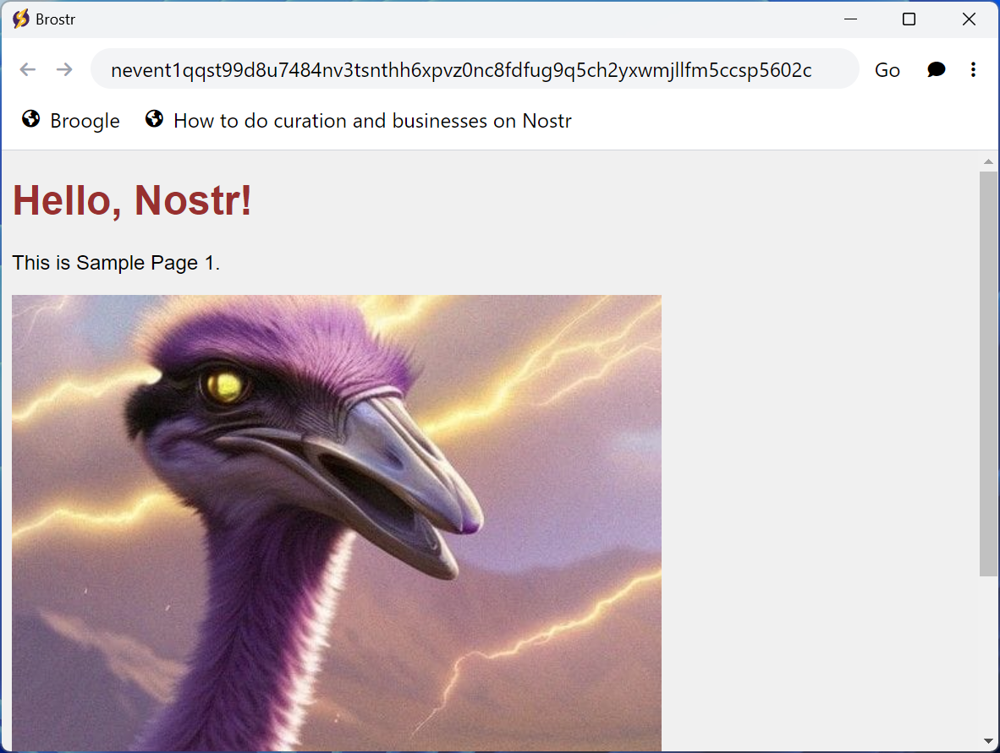
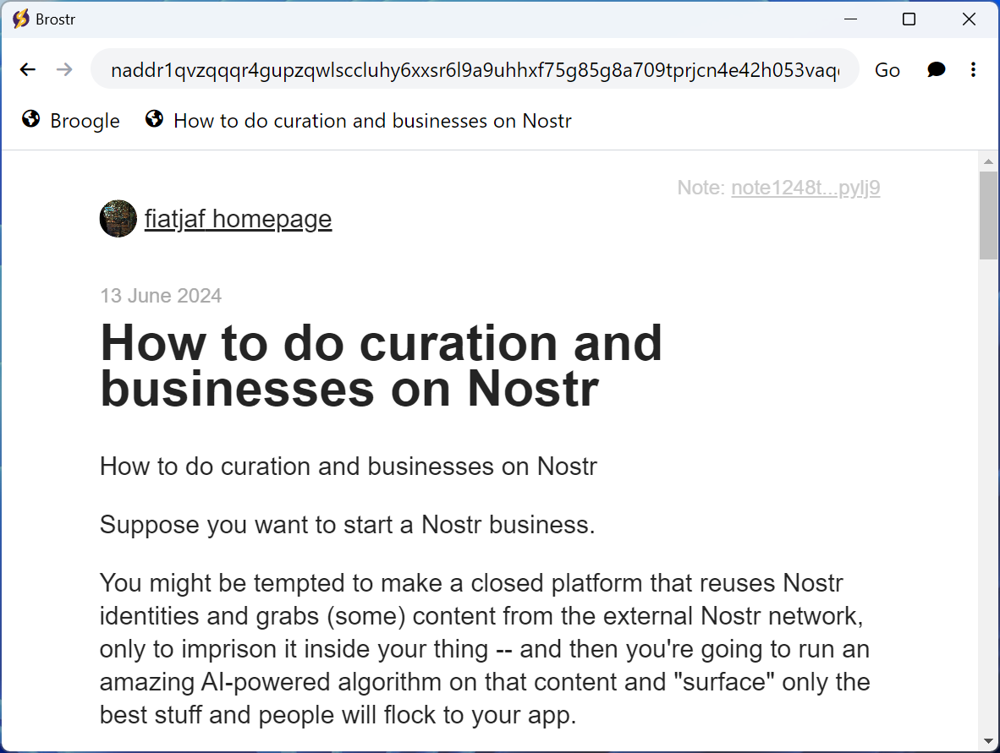
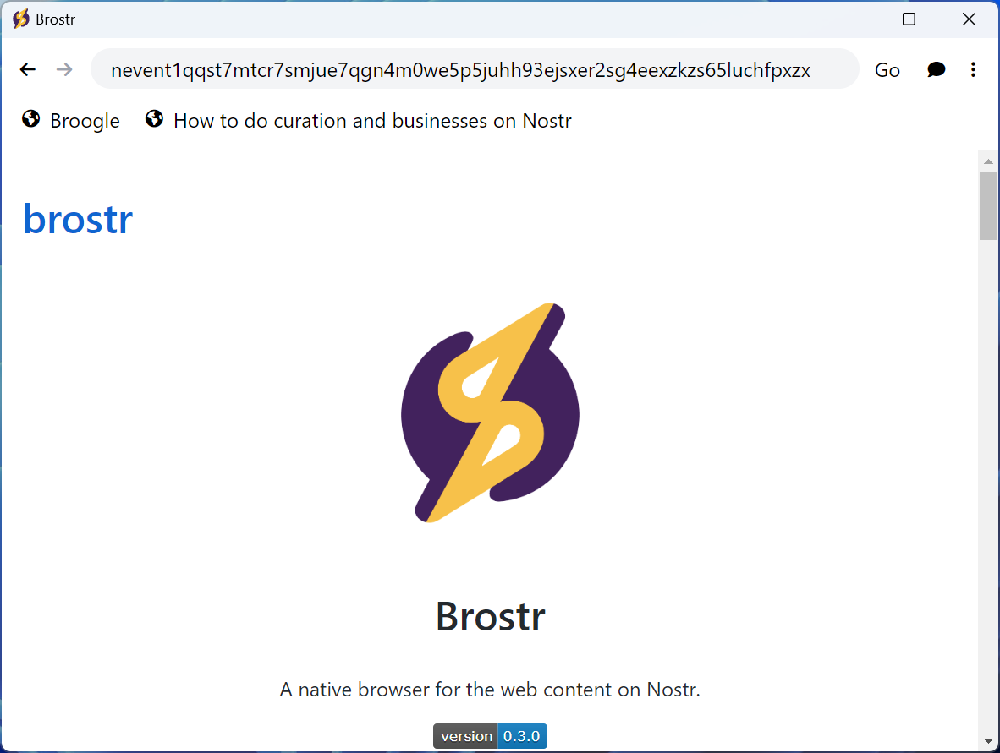
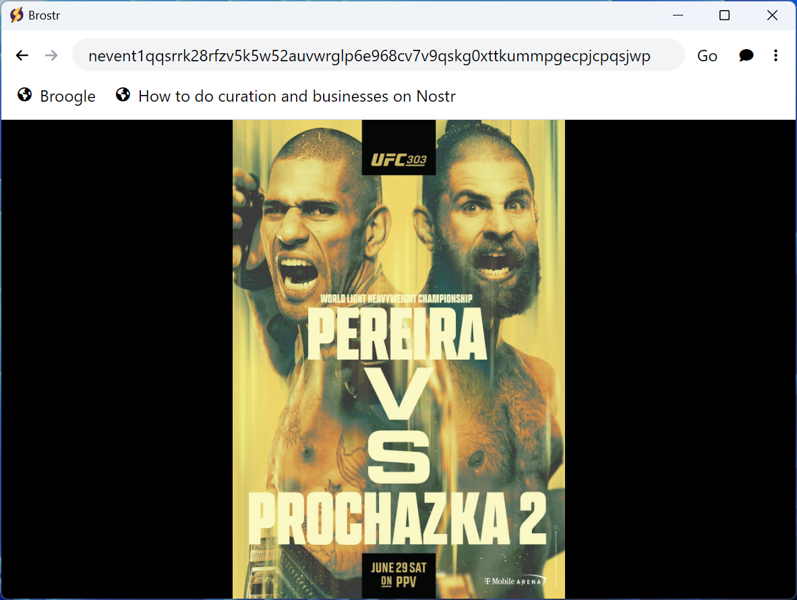
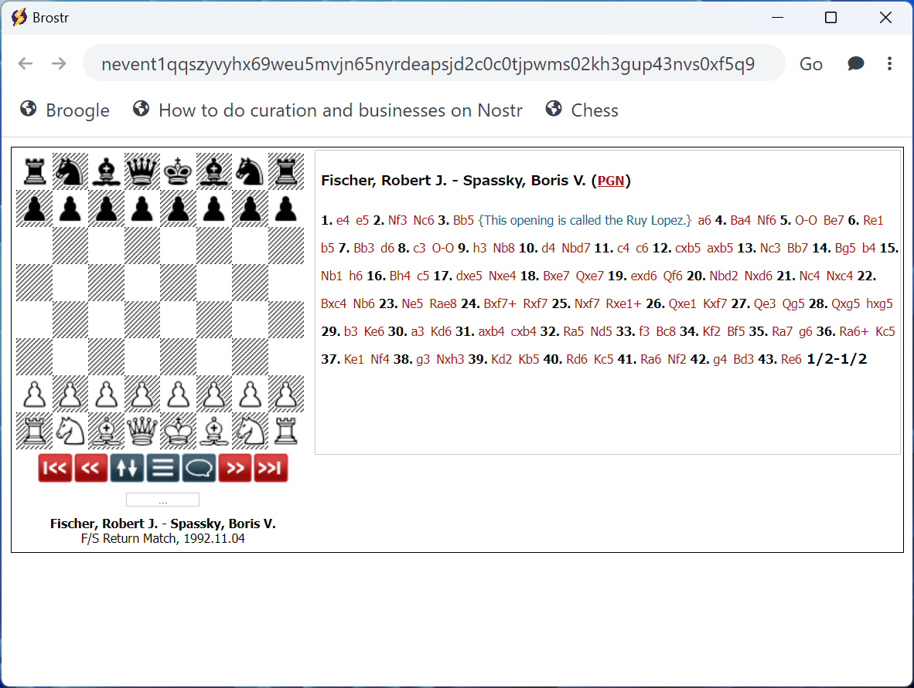
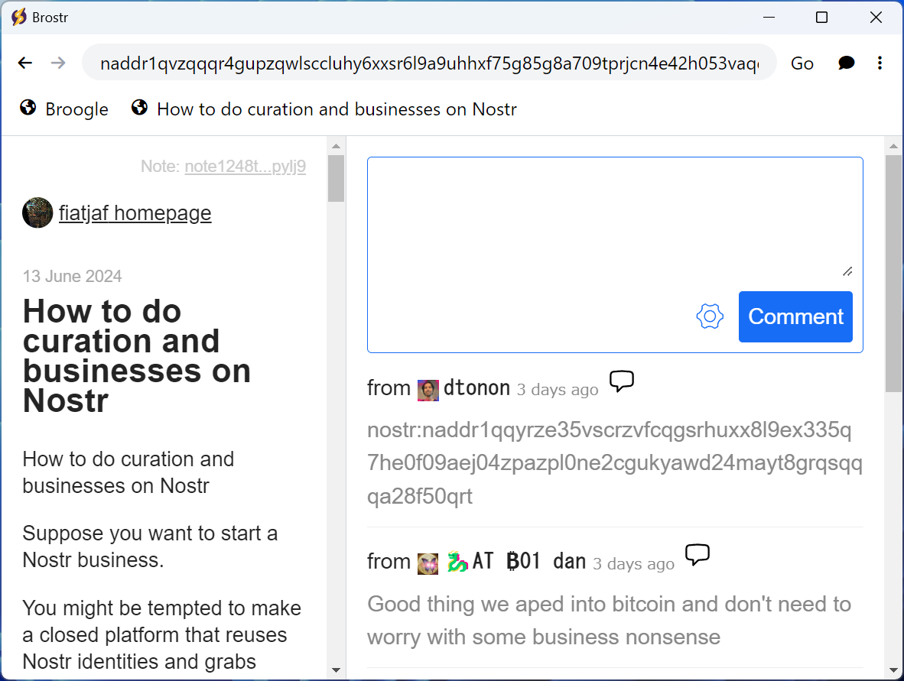

<p align="center">
  
</p>

<h1 align="center">Brostr</h1>

<p align="center">A native browser for the content on Nostr.</p>

<p align="center">
  
</p>

## Features

- Direct access to the content on Nostr without the web server.
- A standardized behavior for various contents.

## Supported NIPs

- [NIP-01: Basic protocol flow description][NIP-01] (Powered by [nocomment][nocomment])
- [NIP-19: bech32-encoded entities][NIP-19]
- [NIP-21: `nostr:` URI scheme][NIP-21]
- [NIP-23: Long-form Content][NIP-23] (Powered by [Oracolo][Oracolo])
- [NIP-48: Proxy Tags][NIP-48] (Experimental support)
- [NIP-64: Chess (Portable Game Notation)][NIP-64] (Powered by [JS PGN Viewer][JS PGN Viewer])
- [NIP-94: File Metadata][NIP-94]
- [NIP-95: Storage and Shared File][NIP-95] (Draft NIP)
- [NIP-106: Decentralized Web Hosting on Nostr][NIP-106] (Draft NIP)
- [`nreq`][nreq] (Draft PR)

[NIP-01]: https://github.com/nostr-protocol/nips/blob/master/01.md
[NIP-19]: https://github.com/nostr-protocol/nips/blob/master/19.md
[NIP-21]: https://github.com/nostr-protocol/nips/blob/master/21.md
[NIP-23]: https://github.com/nostr-protocol/nips/blob/master/23.md
[NIP-48]: https://github.com/nostr-protocol/nips/blob/master/48.md
[NIP-64]: https://github.com/nostr-protocol/nips/blob/master/64.md
[NIP-94]: https://github.com/nostr-protocol/nips/blob/master/94.md
[NIP-95]: https://github.com/frbitten/nostr-nips/blob/NIP-95/95.md
[NIP-106]: https://github.com/studiokaiji/nips/blob/master/106.md
[nreq]: https://github.com/nostr-protocol/nips/pull/882
[nocomment]: https://github.com/fiatjaf/nocomment
[Oracolo]: https://github.com/dtonon/oracolo
[JS PGN Viewer]: https://github.com/toomasr/jspgnviewer

## Screenshots

| HTML Content                      | Long-form Content                      | Proxy                      | Image                      | Chess                      | Comments                      |
| --------------------------------- | -------------------------------------- | -------------------------- | -------------------------- | -------------------------- | ----------------------------- |
|  |  |  |  |  |  |

## Install

Download the binary from the [release page](https://github.com/AsaiToshiya/brostr/releases/latest), or use it directly in the browser without downloading by visiting https://asaitoshiya.github.io/brostr/src/.

## Development

### Setup

```bash
git clone https://github.com/AsaiToshiya/brostr.git
cd brostr
pnpm install
curl -o oracolo/dist/index.html --create-dirs https://raw.githubusercontent.com/dtonon/oracolo/164bdace1f41da1c8810078003e3258e43b8f9cd/dist/index.html
curl -o nocomment/embed.js --create-dirs https://nocomment.fiatjaf.com/embed.js
curl -OL https://github.com/toomasr/jspgnviewer/releases/download/jspgnviewer-wordpress-0.7.3/pgnviewer-0.7.3.zip
tar -xf pgnviewer-0.7.3.zip
rm pgnviewer-0.7.3.zip
del pgnviewer-0.7.3.zip
curl -o nreq/dist/nreq.js --create-dirs https://asaitoshiya.github.io/nostr-toybox/nreq/dist/nreq.js
```

### Run

```bash
pnpm start
```

## License

    MIT License

    Copyright (c) 2023 Asai Toshiya

    Permission is hereby granted, free of charge, to any person obtaining a copy
    of this software and associated documentation files (the "Software"), to deal
    in the Software without restriction, including without limitation the rights
    to use, copy, modify, merge, publish, distribute, sublicense, and/or sell
    copies of the Software, and to permit persons to whom the Software is
    furnished to do so, subject to the following conditions:

    The above copyright notice and this permission notice shall be included in all
    copies or substantial portions of the Software.

    THE SOFTWARE IS PROVIDED "AS IS", WITHOUT WARRANTY OF ANY KIND, EXPRESS OR
    IMPLIED, INCLUDING BUT NOT LIMITED TO THE WARRANTIES OF MERCHANTABILITY,
    FITNESS FOR A PARTICULAR PURPOSE AND NONINFRINGEMENT. IN NO EVENT SHALL THE
    AUTHORS OR COPYRIGHT HOLDERS BE LIABLE FOR ANY CLAIM, DAMAGES OR OTHER
    LIABILITY, WHETHER IN AN ACTION OF CONTRACT, TORT OR OTHERWISE, ARISING FROM,
    OUT OF OR IN CONNECTION WITH THE SOFTWARE OR THE USE OR OTHER DEALINGS IN THE
    SOFTWARE.
